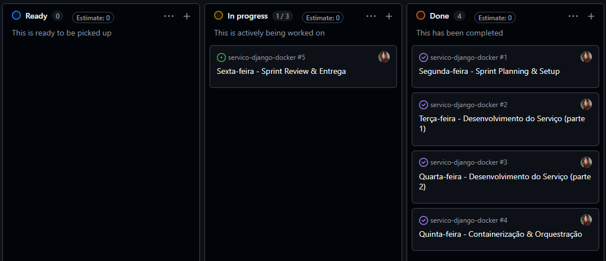

# Serviço Django + Docker

Projeto de estudo simulando o papel de Desenvolvedor em uma equipe Ágil, com entrega de uma aplicação Django (Catálogo de Produtos) containerizada com Docker e orquestrada via Docker Compose.

## 📋 Pré-requisitos

- [Python 3.10+](https://www.python.org/downloads/)
- [Docker Desktop](https://docs.docker.com/desktop/) (com virtualização habilitada na BIOS)
- Git

## 🚀 Como rodar a aplicação

### Opção 1: Usando Docker Compose (recomendado)

1. Clone o repositório:

   ```bash
   git clone https://github.com/SEU-USUARIO/servico-django-docker.git
   cd servico-django-docker
   ```

2. Suba o serviço com o comando:

   ```bash
   docker compose up --build
   ```

3. Acesse no navegador:

   ```
   http://localhost:8000
   ```

4. Para parar o serviço:

   ```bash
   docker compose down
   ```

### Opção 2: Rodando localmente sem Docker (desenvolvimento)

```bash
python -m venv venv
source venv/bin/activate   # Linux/Mac
venv\Scripts\Activate.ps1  # Windows PowerShell

pip install -r requirements.txt
python manage.py migrate
python manage.py runserver 0.0.0.0:8000
```

## 🗂️ Quadro Kanban da Sprint

O planejamento e acompanhamento das tarefas da semana foi feito no GitHub Projects, seguindo o modelo Kanban com as colunas **To Do**, **Doing** e **Done**.



## 📅 Cronograma da Sprint

| Dia | Atividades |
|---|---|
| Segunda | Sprint Planning, criação do repositório, quadro Kanban e ambiente virtual |
| Terça e Quarta | Desenvolvimento do serviço Django (Catálogo de Produtos) |
| Quinta | Containerização (Dockerfile) e orquestração (docker-compose.yml) |
| Sexta | Testes finais, documentação e entrega |

## 🛠️ Tecnologias utilizadas

- Python 3.10
- Django
- Docker / Docker Compose
- SQLite (banco de dados local)

## 👤 Autor

Desenvolvido como atividade prática de simulação de Sprint em um framework Ágil.